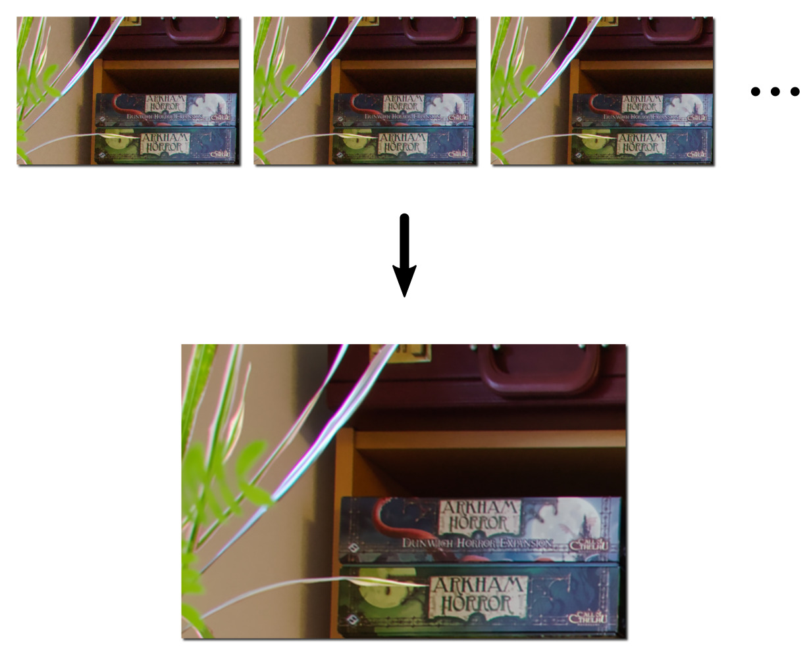

Create super resolution image by stacking multiple images
=========================================================

A simple Python script that uses ImageMagick and Hugin to create
super-resolution images with reduced noise by stacking multiple photos.

Images should be taken in close succession (ideally using continuous mode)
while holding the camera with the hand (it is intended that the original
images are not aligned perfectly to get sub-pixel information).

The basic procedure performed by this script is:

1. Resize images by factor 2.
2. Align them.
3. Combine them by averaging the stack.

This script is based on a similar one posted on
[pixls.us](https://discuss.pixls.us/t/script-to-automate-creation-of-superresolution-images-from-a-series-of-handheld-shots/3163).

Requirements:

- ImageMagick for resizing.
- Hugin for aligning and stacking

Example Usage:

To stack all jpg images in the current directory

    sr_stack *.jpg --output stacked.tif

Exemplary result stacking twelve rather noisy images:

--------------------------------------------------------------------------------

(c) 2020 Felix Widmaier

License: MIT
